# Documentación técnica del proyecto SpaceKids POS

## 1. Resumen general

El proyecto es un sistema SaaS para operación de salones/eventos infantiles y punto de venta. Está dividido en:

- `frontend/`: aplicación React Router + TypeScript + Tailwind/DaisyUI.
- `backend/`: API REST Spring Boot + Spring Security + JPA/Hibernate.
- Base de datos: MariaDB, administrada por JPA con `spring.jpa.hibernate.ddl-auto=update`.

La aplicación maneja múltiples negocios mediante un modelo multi-tenant. Cada petición autenticada lleva un JWT; el backend extrae de ese token el `tenantId`, `branchId`, `userId` y `role`, y con eso filtra las operaciones por negocio/sucursal.

## 2. Tablas principales y relaciones

Las tablas nacen de las entidades JPA del backend. Los identificadores internos son `id` autoincrementales, y la mayoría de entidades expone un `publicId` UUID para usarlo en la API sin revelar IDs internos.

### 2.1 `tenants`

Representa el negocio o empresa que usa el SaaS.

Campos clave:

- `id`: llave primaria interna.
- `public_id`: UUID público.
- `business_name`: nombre del negocio.
- `phone`, `website`, `logo_url`: datos comerciales.
- `status`: `ACTIVE`, `SUSPENDED`, `CANCELLED`.
- `inventory_mode`: `STRICT`, `WARNING`, `DISABLED`.
- `created_at`: fecha de alta.

Relaciones:

- Un `tenant` tiene muchas `branches`.
- Un `tenant` tiene muchos `users`.
- Un `tenant` tiene muchos `products`.
- Un `tenant` tiene muchas `orders`.
- Un `tenant` tiene muchas `payments`.
- Un `tenant` tiene muchas `cash_registers`.
- Un `tenant` tiene una configuración de inventario en `tenant_settings`.
- Un `tenant` tiene una configuración fiscal en `tax_settings`.

### 2.2 `branches`

Representa una sucursal del negocio.

Campos clave:

- `id`, `public_id`.
- `tenant_id`: FK hacia `tenants`.
- `name`, `address`, `phone`.

Relaciones:

- Muchas sucursales pertenecen a un `tenant`.
- Una sucursal puede tener muchos `users`.
- Una sucursal puede tener muchas `orders`, `payments` y `cash_registers`.

### 2.3 `users`

Usuarios operadores del sistema.

Campos clave:

- `id`, `public_id`.
- `tenant_id`: FK hacia `tenants`.
- `branch_id`: FK hacia `branches`.
- `name`, `email`, `password`.
- `role`: `ADMIN`, `MANAGER`, `CASHIER`, `EMPLOYEE`.
- `active`.
- `created_at`.

Restricciones:

- `email` es único por `tenant`: `(tenant_id, email)`.

Relaciones:

- Un usuario pertenece a un `tenant` y a una `branch`.
- Un usuario crea `orders`.
- Un usuario registra `payments`.
- Un usuario abre/cierra cajas (`cash_registers.opened_by`, `cash_registers.closed_by`).

### 2.4 `products`

Catálogo de productos, servicios y paquetes.

Campos clave:

- `id`, `public_id`.
- `tenant_id`: FK hacia `tenants`.
- `name`, `description`.
- `price`.
- `stock`: solo aplica para `PRODUCT`.
- `type`: `PRODUCT`, `SERVICE`, `PACKAGE`.
- `active`.
- `department`.
- `duration_minutes`: duración de timer para `SERVICE`.
- `requires_schedule`: aplica para `PACKAGE`.
- `created_at`, `updated_at`.

Reglas de negocio:

- `PRODUCT`: requiere `stock`, no usa duración ni agenda.
- `SERVICE`: requiere `durationMinutes`, no usa stock; se usa para timers.
- `PACKAGE`: puede requerir agenda; no usa stock ni duración.

### 2.5 `orders`

Orden de venta en el POS.

Campos clave:

- `id`, `publicId`.
- `tenant_id`: FK hacia `tenants`.
- `branch_id`: FK hacia `branches`.
- `user_id`: FK hacia `users`.
- `status`: `OPEN`, `PARTIALLY_PAID`, `CLOSED`, `CANCELLED`.
- `subtotal`, `tax`, `total_amount`.
- `customer_name`: nombre del cliente.
- `child_name`: nombre del niño(a).
- `created_at`, `closed_at`.

Relaciones:

- Una orden pertenece a un tenant, sucursal y usuario.
- Una orden tiene muchos `order_items`.
- Una orden puede tener muchos `payments`.

### 2.6 `order_items`

Detalle de productos/servicios agregados a una orden.

Campos clave:

- `id`, `public_id`.
- `order_id`: FK hacia `orders`.
- `product_id`: FK hacia `products`.
- `quantity`.
- `unit_price`.
- `subtotal`.
- `warning`: por ejemplo venta sin stock si inventario está en modo `WARNING`.
- `status`: `ACTIVE`, `VOIDED`, `FINISHED`.
- `event_date`, `start_time`, `end_time`: campos de agenda/evento.
- `session_start`: inicio real del timer.
- `session_end`: fin calculado del timer.
- `duration_minutes`: duración de la sesión.
- `active`: indica si el timer sigue corriendo.

Uso de timers:

- Cuando se agrega un producto de tipo `SERVICE`, el backend guarda:
  - `session_start = now`.
  - `duration_minutes = product.durationMinutes`.
  - `session_end = now + durationMinutes`.
  - `active = true`.
- Un scheduler del backend corre cada 30 segundos y marca como `FINISHED` los items cuyo `session_end` ya pasó.

### 2.7 `payments`

Pagos registrados sobre una orden.

Campos clave:

- `id`, `public_id`.
- `order_id`: FK hacia `orders`.
- `tenant_id`: FK hacia `tenants`.
- `branch_id`: FK hacia `branches`.
- `user_id`: FK hacia `users`.
- `amount`: monto aplicado a la orden.
- `amount_received`: monto recibido, útil para efectivo.
- `change_amount`: cambio.
- `payment_method`: `CASH`, `CARD`, `TRANSFER`.
- `reference`: referencia para tarjeta/transferencia.
- `created_at`.

Reglas:

- En efectivo se puede recibir más que el restante y calcular cambio.
- En tarjeta/transferencia no se permite exceder el restante.
- Si queda saldo pendiente, la orden pasa a `PARTIALLY_PAID`.
- Si el pago cubre el total, el frontend llama después a cerrar orden.

### 2.8 `cash_registers`

Caja por sucursal.

Campos clave:

- `id`, `public_id`.
- `tenant_id`: FK hacia `tenants`.
- `branch_id`: FK hacia `branches`.
- `opened_by`: usuario que abrió caja.
- `closed_by`: usuario que cerró caja.
- `opening_amount`.
- `closing_amount`.
- `expected_amount`.
- `difference`.
- `opened_at`, `closed_at`.
- `status`: `OPEN`, `CLOSED`.

Reglas:

- Solo puede existir una caja abierta por sucursal.
- Para cerrar caja se calcula el efectivo esperado como `openingAmount + cashSales`.
- También se reportan ventas por efectivo, tarjeta y transferencia.

### 2.9 `tenant_settings`

Configuración operativa del tenant.

Campos clave:

- `id`.
- `tenant_id`: FK única hacia `tenants`.
- `inventory_mode`: `STRICT`, `WARNING`, `DISABLED`.

### 2.10 `tax_settings`

Configuración fiscal del tenant.

Campos clave:

- `id`.
- `tenant_id`: FK hacia `tenants`.
- `tax_enabled`.
- `tax_rate`: por defecto `0.16`.

## 3. Diagrama de relaciones

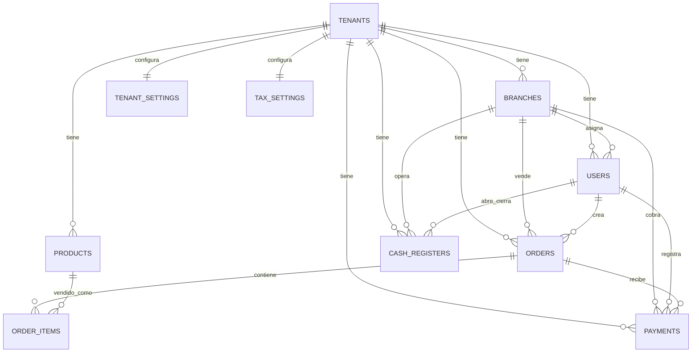

## 4. Funcionamiento del POS

El POS está en `frontend/app/routes/dashboard/pos.tsx` y consume funciones definidas en `frontend/app/lib/api.ts`.

### 4.1 Apertura de caja

1. Al cargar POS, el frontend llama `GET /api/cash/current`.
2. Si hay caja abierta, habilita ventas.
3. Si no hay caja abierta, muestra el modal de apertura.
4. Al abrir caja, manda `POST /api/cash/open` con `openingAmount`.

Sin caja abierta, los productos aparecen bloqueados y no se puede vender.

### 4.2 Creación de orden

1. El cajero captura opcionalmente:
   - Nombre del cliente.
   - Nombre del niño(a).
2. Al agregar el primer producto, si todavía no existe orden, el frontend llama:
   - `POST /api/orders`
   - Body: `{ customerName, childName }`.
3. El backend crea la orden con:
   - Tenant, sucursal y usuario tomados del JWT.
   - Estado `OPEN`.
   - Totales en cero.

### 4.3 Agregar productos, servicios o paquetes

Cuando se hace clic en un producto:

1. Si el item ya existe en la orden, el frontend llama:
   - `PUT /api/orders/{orderPublicId}/items/{itemPublicId}`
   - Incrementa `quantity`.
2. Si no existe, llama:
   - `POST /api/orders/{orderPublicId}/items`
   - Body: `{ productPublicId, quantity: 1 }`.
3. El backend:
   - Busca el producto activo del tenant.
   - Aplica reglas de inventario.
   - Crea `order_item`.
   - Resta stock si aplica.
   - Recalcula subtotal, IVA y total.

### 4.4 Timers para niños

Los servicios (`type = SERVICE`) se tratan como sesiones temporizadas:

1. El producto debe tener `durationMinutes`.
2. Al agregarlo a la orden, el backend crea un timer:
   - `sessionStart`: momento de alta del servicio.
   - `sessionEnd`: hora final calculada.
   - `durationMinutes`: duración configurada.
   - `active = true`.
3. React muestra un contador vivo en el carrito de POS para cada servicio activo.
4. Cuando el contador llega a cero, React muestra `Tiempo terminado`.
5. El backend ejecuta un scheduler cada 30 segundos para marcar el item como:
   - `active = false`.
   - `status = FINISHED`.
6. El frontend refresca periódicamente la orden mientras existan timers activos para sincronizarse con ese cambio.

### 4.5 Cobro

1. El cajero presiona `Cobrar`.
2. Selecciona método:
   - `CASH`.
   - `CARD`.
   - `TRANSFER`.
3. El frontend llama:
   - `POST /api/orders/{orderPublicId}/payments`.
4. El backend registra el pago.
5. Si queda saldo, la orden queda `PARTIALLY_PAID`.
6. Si ya no queda saldo, el frontend llama:
   - `POST /api/orders/{orderPublicId}/close`.
7. El backend valida que el total pagado cubra el total de la orden y marca `CLOSED`.

### 4.6 Ticket

Al imprimir ticket, el frontend llama:

- `GET /api/orders/{orderPublicId}/ticket`.

El backend genera HTML con datos del tenant, sucursal, cajero, productos activos y pagos.

### 4.7 Cierre de caja

1. El frontend llama `GET /api/cash/current` para traer resumen actualizado.
2. El cajero captura efectivo contado.
3. Se envía:
   - `POST /api/cash/close`
   - Body: `{ countedCash }`.
4. El backend calcula:
   - Ventas en efectivo.
   - Ventas con tarjeta.
   - Ventas por transferencia.
   - Efectivo esperado.
   - Diferencia contra efectivo contado.

## 5. Conexión frontend-backend

La conexión está centralizada en `frontend/app/lib/api.ts`.

### 5.1 URL base

```ts
const API_BASE = "http://localhost:8080/api";
```

El frontend corre en `http://localhost:5173` y el backend en `http://localhost:8080`.

### 5.2 Autenticación

1. Login:
   - Frontend llama `POST /api/auth/login`.
   - Backend valida tenant, email y password.
   - Backend responde con JWT y datos de usuario/sucursal.
2. Persistencia:
   - React guarda la sesión en `localStorage` bajo `pos_auth`.
3. Peticiones autenticadas:
   - `apiFetch` agrega el header:

```http
Authorization: Bearer <token>
```

4. Backend:
   - `JwtAuthenticationFilter` valida token.
   - Extrae `tenantId`, `branchId`, `userId` y `role`.
   - Guarda esos datos en `TenantContext`.
   - Los servicios usan `TenantContext` para filtrar y proteger datos por tenant.

### 5.3 Manejo de errores

`apiFetch`:

- Si recibe `401` o `403`, limpia `localStorage`.
- Si el usuario está en `/dashboard`, redirige a `/dashboard/login`.
- Si la respuesta no es exitosa, lanza `ApiError` con el mensaje del backend.

### 5.4 CORS

El backend permite peticiones desde:

```text
http://localhost:5173
```

Los métodos permitidos son:

- `GET`
- `POST`
- `PUT`
- `PATCH`
- `DELETE`
- `OPTIONS`

## 6. Flujo técnico de un timer de niño(a)

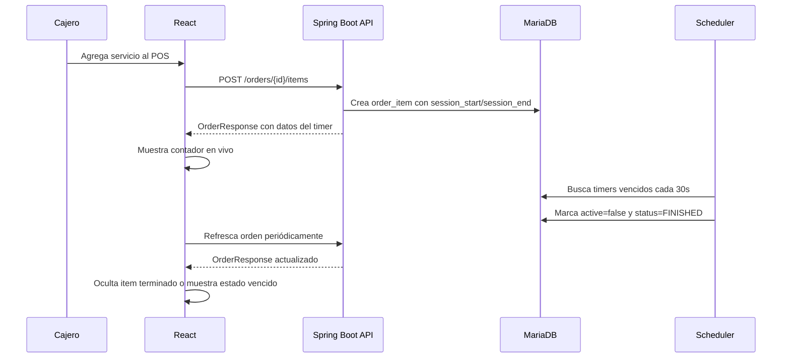

## 7. Archivos importantes

- `frontend/app/lib/api.ts`: cliente HTTP, tipos TypeScript y funciones de API.
- `frontend/app/routes/dashboard/pos.tsx`: interfaz principal del POS, carrito, caja, cobro y timers.
- `backend/src/main/java/com/example/demo/order/service/OrderService.java`: creación de órdenes, items, recálculo de totales y timers.
- `backend/src/main/java/com/example/demo/order/service/OrderSessionScheduler.java`: cierre automático de sesiones vencidas.
- `backend/src/main/java/com/example/demo/payment/service/PaymentService.java`: registro de pagos.
- `backend/src/main/java/com/example/demo/cash/service/CashService.java`: apertura, consulta y cierre de caja.
- `backend/src/main/java/com/example/demo/security/JwtAuthenticationFilter.java`: autenticación JWT y carga de contexto multi-tenant.

## 8. Diagnóstico técnico por área

### 8.1 Base de datos

El modelo actual cubre las entidades necesarias para operar el POS, pero todavía depende de Hibernate `ddl-auto=update` para evolucionar el esquema. Para un equipo de developers, esto puede ser riesgoso porque cada ambiente puede terminar con una estructura distinta.

Observaciones:

- Las relaciones principales están bien aisladas por `tenant_id`.
- Se usa `publicId` para exponer entidades por API sin revelar IDs internos.
- La tabla `order_items` ya contiene campos pensados para timers (`session_start`, `session_end`, `duration_minutes`, `active`).
- `orders` guarda `customer_name` y `child_name`, lo cual permite asociar la venta con el menor.
- `payments` contiene campos para `amount_received` y `change_amount`, pero el flujo actual debería revisar que se persistan siempre que aplique.
- Existen datos sensibles en configuración de backend. En ambientes reales deben moverse a variables de entorno o secretos administrados.

Mejoras recomendadas:

| Área | Recomendación | Beneficio |
|---|---|---|
| Migraciones | Agregar Flyway o Liquibase | Esquemas versionados y reproducibles |
| Índices | Indexar `tenant_id`, `branch_id`, `public_id`, `order_id`, `session_end`, `status` | Mejor rendimiento en POS y reportes |
| Auditoría | Agregar `created_by`, `updated_by`, `updated_at` donde aplique | Trazabilidad operativa |
| Timers | Separar estado de sesión en campos explícitos o tabla dedicada | Mejor control de pausa, extensión y finalización |
| Seguridad | Externalizar credenciales y secretos | Evita exposición accidental |
| Integridad | Constraints únicas por tenant para catálogos críticos | Evita duplicados por negocio |

### 8.2 Backend

El backend tiene una estructura modular clara por dominio: auth, tenant, branch, user, product, order, payment, cash, dashboard, ticket y settings.

Fortalezas:

- API REST separada por controladores.
- Servicios de negocio concentrados en clases dedicadas.
- Seguridad stateless con JWT.
- Multi-tenancy resuelto mediante `TenantContext`.
- Uso de DTOs para entrada/salida.
- Scheduler existente para sesiones temporizadas.

Riesgos técnicos:

- `TenantContext` debe limpiarse correctamente al terminar cada request para evitar fuga de contexto entre hilos.
- El scheduler actual corre por polling cada 30 segundos; para pocos datos funciona, pero puede requerir índices y/o colas si crece el volumen.
- `OrderItem.status` mezcla estado comercial (`ACTIVE`, `VOIDED`) con estado de timer (`FINISHED`), lo cual puede causar confusión en reportes de ventas.
- El cierre automático del timer marca el item como `FINISHED`; si los reportes solo consideran `ACTIVE`, podrían dejar fuera servicios ya consumidos.
- Las credenciales y secretos no deberían vivir en `application.properties`.
- Sería conveniente agregar pruebas unitarias y de integración para órdenes, pagos, caja y timers.

### 8.3 Frontend

El frontend centraliza la conexión al backend en `app/lib/api.ts` y el POS en `app/routes/dashboard/pos.tsx`.

Fortalezas:

- Tipos TypeScript para contratos de API.
- `apiFetch` centraliza token, errores y redirección por sesión expirada.
- POS permite múltiples pestañas de orden.
- UI clara para caja, productos, carrito y cobro.

Riesgos técnicos:

- `API_BASE` está fijo en `http://localhost:8080/api`; conviene leerlo de variables de entorno.
- El carrito del POS existe solo en memoria; si se refresca la pantalla, se pierden pestañas abiertas en frontend aunque la orden exista en backend.
- Los tipos frontend deberían reflejar todos los campos que ya devuelve el backend para timers: `sessionStart`, `sessionEnd`, `durationMinutes`, `active`.
- El timer debería ser un componente aislado para facilitar pruebas y mantenimiento.
- El POS puede crecer demasiado en un solo archivo; conviene separar caja, catálogo, carrito, pagos y timers.

## 9. Propuesta técnica para mejorar timers de niños

Esta sección describe cambios posibles para implementar en una iteración futura. No es necesario aplicarlos todos al mismo tiempo; se recomienda avanzar por fases.

### 9.1 Objetivo funcional

Permitir que cada servicio de tiempo vendido en el POS tenga un contador visible para el operador, asociado a un niño(a), con estado sincronizado entre frontend y backend.

Casos de uso:

1. El cajero abre caja.
2. Captura cliente y niño(a).
3. Agrega un servicio con duración configurada.
4. El backend inicia la sesión con `sessionStart` y `sessionEnd`.
5. El frontend muestra el tiempo restante.
6. El sistema alerta cuando falten pocos minutos.
7. Al terminar, el backend marca la sesión finalizada.
8. El operador puede cobrar, imprimir ticket y consultar historial.

### 9.2 Cambios recomendados en backend

#### Opción A: evolucionar `order_items`

Mantener los timers dentro de `order_items`.

Campos sugeridos:

| Campo | Tipo | Uso |
|---|---|---|
| `session_start` | `LocalDateTime` | Inicio real de uso |
| `session_end` | `LocalDateTime` | Fin calculado |
| `duration_minutes` | `Integer` | Duración comprada |
| `timer_status` | enum | `PENDING`, `RUNNING`, `PAUSED`, `FINISHED`, `CANCELLED` |
| `paused_at` | `LocalDateTime` | Momento de pausa |
| `total_paused_seconds` | `Long` | Tiempo acumulado pausado |
| `finished_at` | `LocalDateTime` | Cierre real |
| `extended_minutes` | `Integer` | Minutos agregados |

Ventaja:

- Menor cambio estructural.
- Aprovecha la relación actual `Order -> OrderItem -> Product`.

Desventaja:

- `order_items` queda con muchas responsabilidades.

#### Opción B: crear tabla `child_sessions`

Separar timers en una tabla dedicada.

Campos sugeridos:

| Campo | Tipo | Uso |
|---|---|---|
| `id` | Long | PK interna |
| `public_id` | UUID | ID público |
| `tenant_id` | FK | Aislamiento multi-tenant |
| `branch_id` | FK | Sucursal |
| `order_id` | FK | Orden relacionada |
| `order_item_id` | FK | Servicio vendido |
| `child_name` | String | Niño(a) |
| `started_at` | DateTime | Inicio |
| `ends_at` | DateTime | Fin programado |
| `status` | enum | Estado de sesión |
| `duration_minutes` | Integer | Duración base |
| `extended_minutes` | Integer | Extensiones |
| `created_by` | FK user | Operador |

Ventaja:

- Dominio más claro para timers.
- Facilita pausa, reanudación, alertas, historial y reportes.

Desventaja:

- Requiere migración y nuevos repositorios/servicios.

### 9.3 Endpoints sugeridos para timers

Si se mantiene el modelo actual:

| Método | Endpoint | Propósito |
|---|---|---|
| `GET` | `/api/orders/{orderPublicId}` | Consultar orden con timers |
| `POST` | `/api/orders/{orderPublicId}/items` | Agregar servicio e iniciar timer |
| `POST` | `/api/orders/{orderPublicId}/items/{itemPublicId}/timer/pause` | Pausar timer |
| `POST` | `/api/orders/{orderPublicId}/items/{itemPublicId}/timer/resume` | Reanudar timer |
| `POST` | `/api/orders/{orderPublicId}/items/{itemPublicId}/timer/extend` | Agregar minutos |
| `POST` | `/api/orders/{orderPublicId}/items/{itemPublicId}/timer/finish` | Finalizar manualmente |

Si se crea `child_sessions`:

| Método | Endpoint | Propósito |
|---|---|---|
| `GET` | `/api/child-sessions/active` | Timers activos por sucursal |
| `GET` | `/api/child-sessions/{publicId}` | Detalle de una sesión |
| `POST` | `/api/child-sessions/{publicId}/pause` | Pausar |
| `POST` | `/api/child-sessions/{publicId}/resume` | Reanudar |
| `POST` | `/api/child-sessions/{publicId}/extend` | Extender |
| `POST` | `/api/child-sessions/{publicId}/finish` | Finalizar |

### 9.4 Contrato de respuesta sugerido

El frontend necesita recibir estos campos:

```json
{
  "publicId": "item-public-id",
  "productPublicId": "product-public-id",
  "productName": "Entrada 60 minutos",
  "quantity": 1,
  "unitPrice": 120.00,
  "subtotal": 120.00,
  "status": "ACTIVE",
  "timerStatus": "RUNNING",
  "sessionStart": "2026-06-03T10:00:00",
  "sessionEnd": "2026-06-03T11:00:00",
  "durationMinutes": 60,
  "remainingSeconds": 3590,
  "childName": "Sofía"
}
```

Nota: `remainingSeconds` puede calcularse en backend para evitar diferencias de zona horaria, pero el frontend puede recalcular visualmente cada segundo usando `sessionEnd`.

### 9.5 Cambios recomendados en frontend

Componentes sugeridos:

| Componente | Responsabilidad |
|---|---|
| `POSTimerPanel` | Lista de timers activos de la orden actual |
| `TimerBadge` | Countdown individual por item |
| `TimerProgressBar` | Barra de progreso de sesión |
| `TimerActions` | Pausar, reanudar, extender y finalizar |
| `ActiveSessionsDrawer` | Vista global de niños activos en la sucursal |

Estados visuales:

| Estado | Color sugerido | Condición |
|---|---|---|
| Normal | Verde/primario | Más de 5 minutos restantes |
| Por terminar | Amarillo | Menos de 5 minutos |
| Vencido | Rojo | `remainingSeconds <= 0` |
| Pausado | Azul/gris | `timerStatus = PAUSED` |
| Finalizado | Gris | `timerStatus = FINISHED` |

Sincronización recomendada:

1. Renderizar countdown local cada segundo con `setInterval`.
2. Refrescar backend cada 15-30 segundos para reconciliar estado.
3. Para una versión más avanzada, usar Server-Sent Events o WebSocket.

Mejoras UX recomendadas:

- Mostrar nombre del niño(a) junto al timer.
- Alertar visualmente y con sonido cuando falten 5, 3 y 1 minutos.
- Permitir agregar tiempo extra como venta adicional.
- Evitar que servicios temporizados se fusionen como cantidad `2`; cada niño debe tener su propio timer.
- Mantener una vista global de todos los niños activos, no solo la orden actual.
- Guardar/reabrir órdenes abiertas si se refresca el navegador.

## 10. Propuesta técnica para mejorar el POS

### 10.1 Separación del archivo POS

El archivo del POS concentra mucha lógica. Se recomienda dividirlo por dominio:

```text
frontend/app/routes/dashboard/pos.tsx
frontend/app/components/pos/POSCatalog.tsx
frontend/app/components/pos/POSCart.tsx
frontend/app/components/pos/POSCashPanel.tsx
frontend/app/components/pos/POSPaymentModal.tsx
frontend/app/components/pos/POSTabs.tsx
frontend/app/components/pos/POSTimerPanel.tsx
frontend/app/hooks/usePOSOrders.ts
frontend/app/hooks/useCashRegister.ts
frontend/app/hooks/useTimers.ts
```

Beneficios:

- Menos acoplamiento.
- Mejor testabilidad.
- Más fácil para nuevos developers.
- Permite trabajar en paralelo por componente.

### 10.2 Persistencia de órdenes abiertas

Problema actual:

- Las pestañas de orden viven en estado React.
- Si el navegador se refresca, se pierde la referencia visual.

Mejoras:

- Crear endpoint `GET /api/orders/open?branchId=current`.
- Rehidratar pestañas al cargar POS.
- Guardar `activeOrderTabId` en `localStorage`.
- Mostrar órdenes abiertas por cliente/niño.

### 10.3 Mejoras en cobro

Recomendaciones:

- Persistir `amountReceived` y `changeAmount` en `Payment`.
- Agregar validaciones explícitas por método de pago.
- Permitir pagos mixtos con historial visible.
- Mostrar total pagado, restante y cambio antes de cerrar.
- Agregar idempotency key para evitar pagos duplicados por doble clic o retry.

### 10.4 Mejoras en caja

Recomendaciones:

- Asociar cada pago a una caja abierta (`cash_register_id`).
- No calcular ventas solo por rango de fecha; usar relación directa con la caja.
- Registrar retiros/ingresos manuales de efectivo.
- Agregar corte X y corte Z.
- Mantener historial de cierres por sucursal.

## 11. Propuesta técnica para mejorar conexión frontend-backend

### 11.1 Configuración por ambiente

Cambiar URL fija:

```ts
const API_BASE = "http://localhost:8080/api";
```

Por configuración:

```ts
const API_BASE = import.meta.env.VITE_API_BASE_URL;
```

Ambientes sugeridos:

| Ambiente | Frontend | Backend |
|---|---|---|
| Local | `http://localhost:5173` | `http://localhost:8080/api` |
| Staging | dominio staging | API staging |
| Producción | dominio productivo | API productiva |

### 11.2 Tipado de contratos

Recomendaciones:

- Mantener interfaces en `api.ts` alineadas con DTOs del backend.
- Considerar OpenAPI/Swagger para generar cliente TypeScript.
- Validar respuestas críticas con schemas si el POS crece.

### 11.3 Manejo de sesión

Recomendaciones:

- Agregar refresh token o expiración más controlada.
- Mostrar modal de sesión expirada antes de redirigir.
- Limpiar estado sensible al hacer logout.
- Evitar logs de tokens o headers sensibles.

### 11.4 Estrategia de datos

Recomendaciones:

- Usar una capa de hooks (`useProducts`, `useCashRegister`, `useOrder`, `usePayments`) sobre `api.ts`.
- Evaluar TanStack Query para cache, refetch, retries y estados de carga.
- Usar invalidación de cache después de pagos, cierre de caja y cambios de inventario.

## 12. Roadmap sugerido de implementación

### Fase 1: documentación y seguridad base

- Mover secretos a variables de entorno.
- Agregar `application-local.properties.example`.
- Documentar cómo levantar frontend y backend.
- Agregar migraciones iniciales.

### Fase 2: timers mínimos en POS

- Exponer campos de timer en tipos frontend.
- Mostrar contador por servicio vendido.
- Refrescar orden periódicamente.
- Alertar cuando falte poco tiempo.

### Fase 3: timers robustos

- Agregar `timerStatus`.
- Pausar/reanudar/extender/finalizar.
- Vista global de niños activos por sucursal.
- Reporte de sesiones finalizadas.

### Fase 4: POS operativo avanzado

- Órdenes abiertas persistentes.
- Pagos mixtos detallados.
- Caja relacionada directamente con pagos.
- Cortes y movimientos de caja.

### Fase 5: calidad y contribución

- Tests unitarios backend para servicios críticos.
- Tests de integración para órdenes, pagos y caja.
- Tests frontend para POS.
- OpenAPI para contrato front-back.
- CI con build backend, typecheck frontend y pruebas.

## 13. Reglas para developers que contribuyan

1. No exponer IDs internos en frontend; usar `publicId`.
2. Toda consulta de negocio debe filtrar por `tenantId`.
3. Toda operación del POS debe validar caja abierta cuando aplique.
4. Todo cambio de inventario debe ser transaccional.
5. Todo pago debe ser idempotente o protegerse contra doble envío.
6. Todo timer debe tener una fuente de verdad en backend.
7. El frontend puede mostrar countdown local, pero debe reconciliar con backend.
8. No guardar secretos en el repositorio.
9. Preferir DTOs explícitos sobre exponer entidades JPA.
10. Agregar pruebas cuando se modifiquen órdenes, pagos, caja o timers.

## 14. Diagramas visuales de base de datos y lógica

### 14.1 Base de datos actual

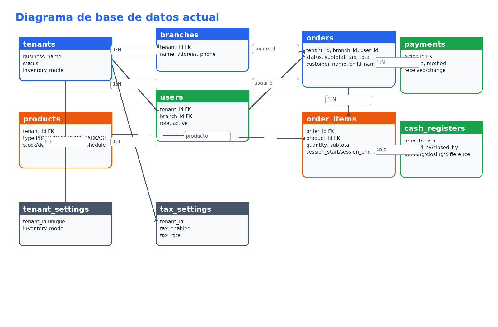

Este diagrama muestra las entidades actuales del backend y cómo se relacionan:

- `tenants` es la raíz multi-tenant.
- `branches`, `users`, `products`, `orders`, `payments`, `cash_registers`, `tenant_settings` y `tax_settings` cuelgan de `tenants`.
- `orders` conecta venta, sucursal, usuario, cliente y niño(a).
- `order_items` conecta la orden con el producto/servicio/paquete vendido.
- `payments` registra los abonos contra una orden.
- `cash_registers` representa cortes de caja por sucursal.

### 14.2 Arquitectura lógica

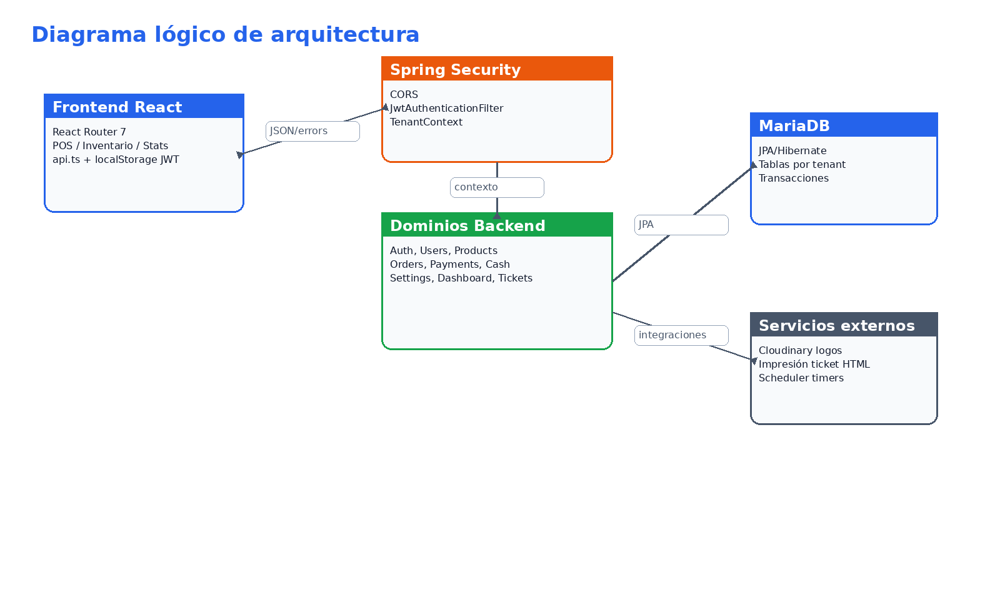

La arquitectura puede entenderse como cuatro capas:

1. **Frontend React**: vistas de dashboard, POS, inventario, usuarios, estadísticas y configuración.
2. **Seguridad/API**: CORS, JWT, `JwtAuthenticationFilter` y `TenantContext`.
3. **Dominios backend**: servicios Java que aplican reglas de negocio.
4. **Persistencia/servicios externos**: MariaDB, Cloudinary, scheduler e impresión HTML.

### 14.3 Flujo lógico del POS

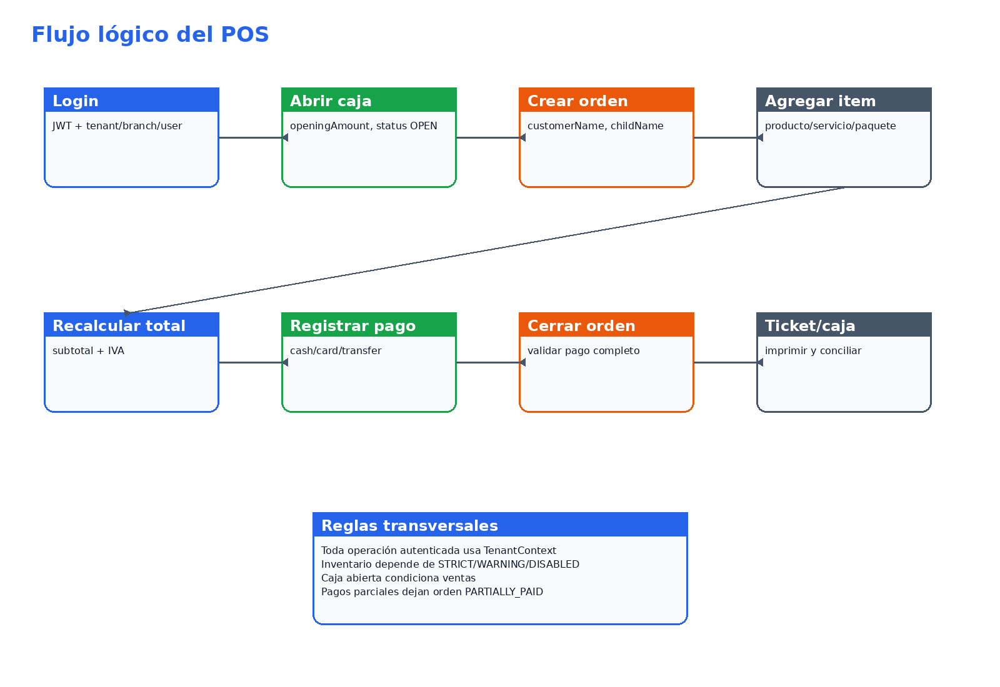

El POS no es únicamente una pantalla de cobro; coordina caja, productos, órdenes, pagos, tickets e inventario. La regla más importante es que cada operación de venta ocurre dentro de un tenant, una sucursal y una caja abierta.

### 14.4 Propuesta de eventos y apartados

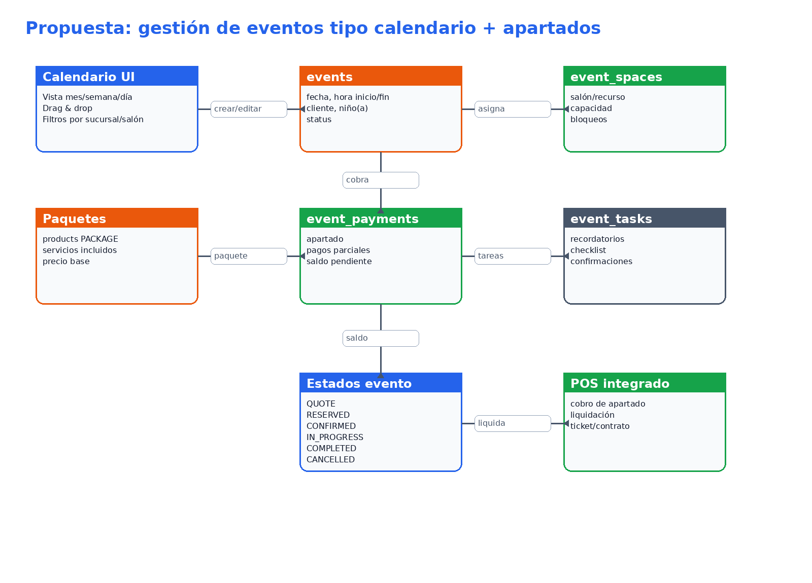

La propuesta de módulo de eventos agrega un calendario visual, espacios/salones, paquetes, apartados, pagos pendientes y estados de seguimiento. La intención es que el proyecto pueda evolucionar desde POS operativo hacia una plataforma completa de eventos infantiles.

## 15. Funcionamiento detallado por entidad

### 15.1 `Tenant`

**Responsabilidad:** representar a cada negocio que usa el SaaS.

Funcionamiento actual:

- Es la entidad raíz de aislamiento de datos.
- El login requiere `tenantPublicId`; esto evita autenticar usuarios sin saber a qué negocio pertenecen.
- Después del login, el JWT contiene el `tenantId`.
- Cada servicio usa `TenantContext.getTenantId()` para consultar solo información del tenant autenticado.
- El estado del tenant (`ACTIVE`, `SUSPENDED`, `CANCELLED`) se valida en el filtro JWT.

Reglas relevantes:

- Si el tenant está suspendido o cancelado, el backend debe bloquear la operación.
- La configuración de inventario puede vivir en `tenants.inventoryMode` y/o `tenant_settings.inventoryMode`; conviene unificar la fuente de verdad.
- Logo, teléfono y sitio web se usan para ticket/configuración visual.

Recomendaciones:

- Crear un dominio explícito `TenantService` para altas, suspensión, reactivación y configuración global.
- Agregar auditoría de cambios de estado.
- Usar migraciones para asegurar que cada tenant tenga `tenant_settings` y `tax_settings`.

### 15.2 `Branch`

**Responsabilidad:** representar sucursales físicas de un tenant.

Funcionamiento actual:

- Se listan desde `/api/branches`.
- El usuario autenticado queda asociado a una sucursal mediante `branchId`.
- La caja y las ventas se calculan por sucursal.
- El POS opera usando la sucursal que viene en el JWT.

Reglas relevantes:

- Una sucursal pertenece a un único tenant.
- Una caja abierta se valida por `branchId`.
- El dashboard y la caja deben considerar siempre la sucursal cuando el reporte sea operativo.

Recomendaciones:

- Agregar CRUD completo de sucursales.
- Agregar estado `active` para desactivar sucursales sin perder historial.
- Modelar recursos internos por sucursal: salones, mesas, áreas infantiles, anfitriones, paquetes disponibles.

### 15.3 `User`

**Responsabilidad:** representar operadores/admins del sistema.

Funcionamiento actual:

- Un usuario pertenece a un tenant y a una sucursal.
- El email es único dentro del tenant.
- El rol determina permisos:
  - `ADMIN`: administración completa.
  - `MANAGER`: operación/configuración parcial.
  - `CASHIER`/`EMPLOYEE`: operación POS según permisos definidos.
- `active=false` bloquea el acceso.

Flujo:

1. Login con tenant, email y password.
2. Backend valida credenciales.
3. Backend genera JWT con rol, tenant, sucursal y usuario.
4. Frontend guarda el JWT en `localStorage`.
5. Cada request usa `Authorization: Bearer <token>`.

Recomendaciones:

- Definir matriz de permisos formal por módulo.
- Evitar hard delete de usuarios; preferir desactivación.
- Agregar cambio de contraseña propio y recuperación.
- Agregar bitácora de acciones críticas: apertura/cierre de caja, cancelaciones, anulaciones, pagos.

### 15.4 `Product`

**Responsabilidad:** catálogo comercial del POS.

Tipos:

| Tipo | Uso | Campos relevantes |
|---|---|---|
| `PRODUCT` | Artículo con inventario | `stock`, `department`, `price` |
| `SERVICE` | Servicio por tiempo | `durationMinutes`, `price` |
| `PACKAGE` | Paquete/evento | `requiresSchedule`, `price` |

Funcionamiento actual:

- `ProductService` aplica reglas distintas según `type`.
- `PRODUCT` exige stock.
- `SERVICE` exige duración y se usa para timers.
- `PACKAGE` está pensado para eventos o paquetes agendables.
- `active=false` funciona como soft delete.

Recomendaciones:

- Separar "catálogo vendible" de "inventario físico" si el negocio crece.
- Permitir composición de paquetes:
  - paquete incluye servicios;
  - paquete incluye productos consumibles;
  - paquete tiene duración base;
  - paquete requiere espacio/salón.
- Agregar precios especiales por sucursal, día u horario.
- Agregar imágenes/categorías visibles en POS.

### 15.5 `Order`

**Responsabilidad:** representar una venta o transacción del POS.

Funcionamiento actual:

- Se crea cuando el cajero agrega el primer producto.
- Guarda cliente y niño(a).
- Inicia en `OPEN`.
- Puede pasar a:
  - `PARTIALLY_PAID` si hay abonos pero falta saldo.
  - `CLOSED` si el pago cubre el total.
  - `CANCELLED` si se cancela la orden.
- Calcula `subtotal`, `tax` y `totalAmount`.

Reglas relevantes:

- Toda orden pertenece a tenant, branch y user.
- El cierre exige pago completo.
- Cancelar orden repone stock de items activos.
- El estado de orden no debería depender de timers, sino del estado comercial/pago.

Recomendaciones:

- Agregar endpoint para recuperar órdenes abiertas por sucursal.
- Asociar orden con caja abierta.
- Agregar campos de pago:
  - `paidAmount`;
  - `balanceDue`;
  - `paymentStatus`: `UNPAID`, `PARTIAL`, `PAID`, `REFUNDED`.
- Separar venta POS inmediata de venta por evento/reservación.

### 15.6 `OrderItem`

**Responsabilidad:** representar cada producto/servicio vendido dentro de una orden.

Funcionamiento actual:

- Guarda producto, cantidad, precio unitario y subtotal.
- Puede tener warning de inventario.
- Tiene estado `ACTIVE`, `VOIDED` o `FINISHED`.
- Para servicios se guardan campos de timer.

Puntos críticos:

- Actualmente `FINISHED` parece relacionarse con timer, no con venta.
- Si reportes solo suman items `ACTIVE`, servicios terminados podrían no contarse si se marca `FINISHED`.
- Para servicios de niños, conviene que cada niño tenga su propio item/timer, no que cantidad aumente sobre el mismo item.

Recomendaciones:

- Separar estado comercial del item (`ACTIVE`, `VOIDED`) de estado de timer (`RUNNING`, `PAUSED`, `FINISHED`).
- Agregar `childName` a nivel de item o crear `child_sessions`.
- Agregar `startedBy`, `finishedBy`, `finishedAt`.
- Agregar capacidad de extensión: vender minutos extra como item adicional o actualizar timer con auditoría.

### 15.7 `Payment`

**Responsabilidad:** registrar pagos/abonos hechos contra una orden.

Funcionamiento actual:

- Se crea desde `/api/orders/{orderPublicId}/payments`.
- Soporta `CASH`, `CARD` y `TRANSFER`.
- Calcula cambio para efectivo.
- En métodos no efectivo no permite exceder el restante.
- Si el pago no cubre el total, la orden queda `PARTIALLY_PAID`.

Recomendaciones:

- Persistir siempre `amountReceived` y `changeAmount`.
- Agregar `paymentStatus`: `APPLIED`, `VOIDED`, `REFUNDED`.
- Agregar `cashRegisterId`.
- Agregar `externalReference` para terminales/transferencias.
- Agregar idempotency key para evitar doble pago por doble click.
- Permitir pagos pendientes/apartados para eventos.

### 15.8 `CashRegister`

**Responsabilidad:** controlar apertura y cierre de caja por sucursal.

Funcionamiento actual:

- Solo puede existir una caja abierta por sucursal.
- Se abre con `openingAmount`.
- Se cierra con `countedCash`.
- Calcula:
  - ventas efectivo;
  - ventas tarjeta;
  - ventas transferencia;
  - esperado en caja;
  - diferencia.

Riesgo actual:

- Las ventas se calculan por rango de fecha usando pagos de la sucursal. Es mejor relacionar cada pago directamente con la caja abierta para evitar ambigüedades cuando haya horarios cruzados, reaperturas o correcciones.

Recomendaciones:

- Agregar `cash_register_id` en `payments`.
- Agregar movimientos manuales:
  - entrada de efectivo;
  - salida/retiro;
  - ajuste;
  - gasto menor.
- Agregar cortes X/Z.
- Agregar historial por usuario y sucursal.

### 15.9 `TenantSettings` y `TaxSettings`

**Responsabilidad:** controlar configuración operativa y fiscal.

Funcionamiento actual:

- `TenantSettings` controla modo de inventario.
- `TaxSettings` controla si hay IVA y la tasa.

Recomendaciones:

- Consolidar configuración de inventario en un solo lugar.
- Agregar historial de cambios.
- Permitir tasa fiscal por producto/servicio si el negocio lo requiere.
- Agregar validación de permisos: solo `ADMIN` debería modificar configuración fiscal crítica.

## 16. Funcionamiento detallado por dominio del sistema

### 16.1 Dominio de autenticación y seguridad

Componentes:

- `AuthController`.
- `AuthService`.
- `JwtService`.
- `JwtAuthenticationFilter`.
- `SecurityConfig`.
- `TenantContext`.

Flujo:

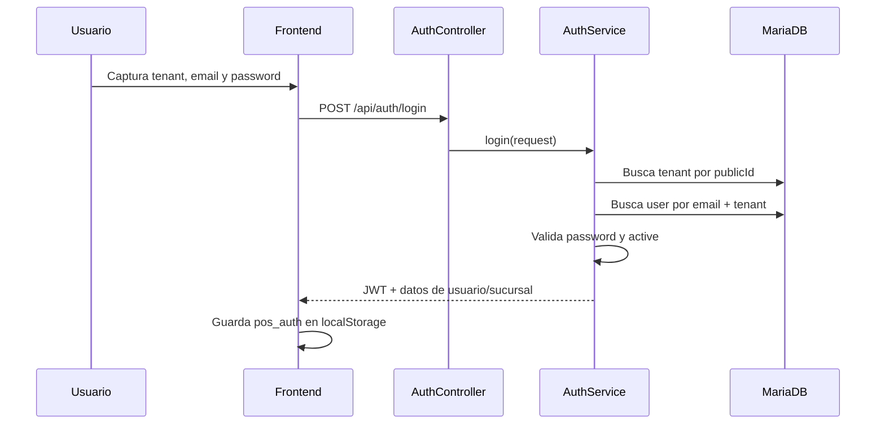

Responsabilidad técnica:

- Identificar tenant antes de autenticar usuario.
- Generar token con contexto suficiente.
- Rechazar tenants inactivos.
- Rechazar usuarios inactivos.
- Exponer roles para autorización por endpoints.

Mejoras:

- Refresh token.
- Logout server-side opcional mediante token blacklist.
- Auditoría de inicios de sesión.
- No imprimir headers/tokens en logs.

### 16.2 Dominio de catálogo e inventario

Componentes:

- `ProductController`.
- `ProductService`.
- `ProductRepository`.
- `TenantSettingsService`.

Funciones actuales:

- Crear producto/servicio/paquete.
- Listar productos activos del tenant.
- Consultar por `publicId`.
- Actualizar.
- Soft delete con `active=false`.
- Activar/desactivar.
- Aplicar reglas por tipo de producto.

Flujo de venta con inventario:

1. POS carga productos activos.
2. Cajero agrega producto.
3. Backend valida stock.
4. Si inventario es:
   - `STRICT`: bloquea venta sin stock.
   - `WARNING`: permite venta y agrega warning.
   - `DISABLED`: ignora stock.
5. Backend descuenta stock si aplica.
6. Si se anula/cancela, repone stock.

Mejoras:

- Tabla `inventory_movements` para trazabilidad.
- Alertas de stock mínimo.
- Ajustes manuales de inventario.
- Kardex por producto.

### 16.3 Dominio de POS y órdenes

Componentes:

- `OrderController`.
- `OrderService`.
- `PaymentController`.
- `PaymentService`.
- `TicketController`.
- `TicketService`.

Funciones actuales:

- Crear orden.
- Agregar item.
- Actualizar cantidad.
- Anular item.
- Cancelar orden.
- Registrar pago.
- Cerrar orden.
- Generar ticket HTML.

Estado recomendado de orden:

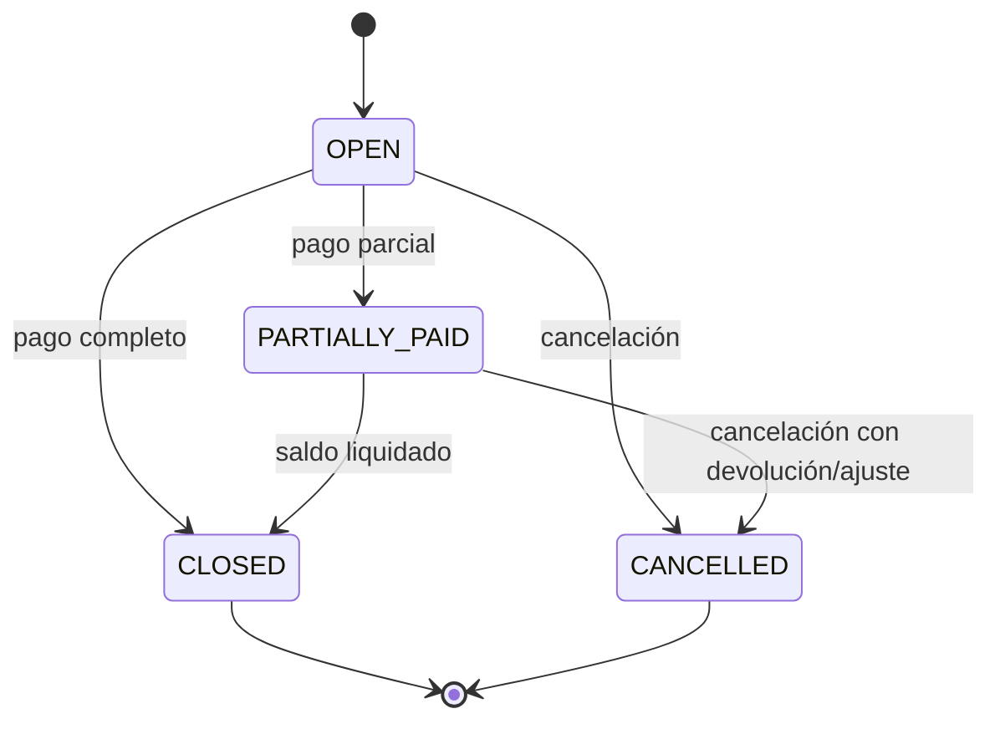

Reglas de consistencia:

- No cobrar órdenes canceladas.
- No cerrar órdenes sin pago completo.
- No modificar items de órdenes cerradas.
- No permitir pagos duplicados por reintentos.
- Toda venta debería estar asociada a una caja abierta.

### 16.4 Dominio de timers de niños

Componentes actuales:

- `Product.type = SERVICE`.
- `Product.durationMinutes`.
- `OrderItem.sessionStart`.
- `OrderItem.sessionEnd`.
- `OrderItem.durationMinutes`.
- `OrderItem.active`.
- `OrderSessionScheduler`.

Funcionamiento actual:

1. Se crea un producto de tipo `SERVICE` con duración.
2. En POS se agrega el servicio a una orden.
3. Backend calcula inicio y fin.
4. Scheduler busca sesiones vencidas cada 30 segundos.
5. Scheduler marca `active=false` y `status=FINISHED`.

Lógica recomendada:

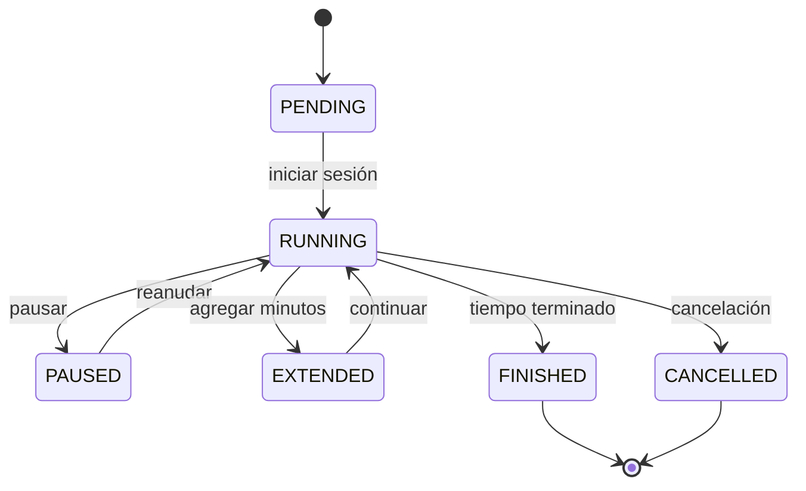

Recomendación clave:

- No usar `OrderItemStatus.FINISHED` para excluirlo de reportes de ventas.
- Crear `timerStatus` o tabla `child_sessions`.
- Mantener `OrderItem.status=ACTIVE` mientras sea una venta válida, aunque el timer ya haya finalizado.

### 16.5 Dominio de caja

Funciones actuales:

- Abrir caja.
- Consultar caja actual.
- Cerrar caja.
- Calcular ventas por método.
- Calcular diferencia.

Flujo:

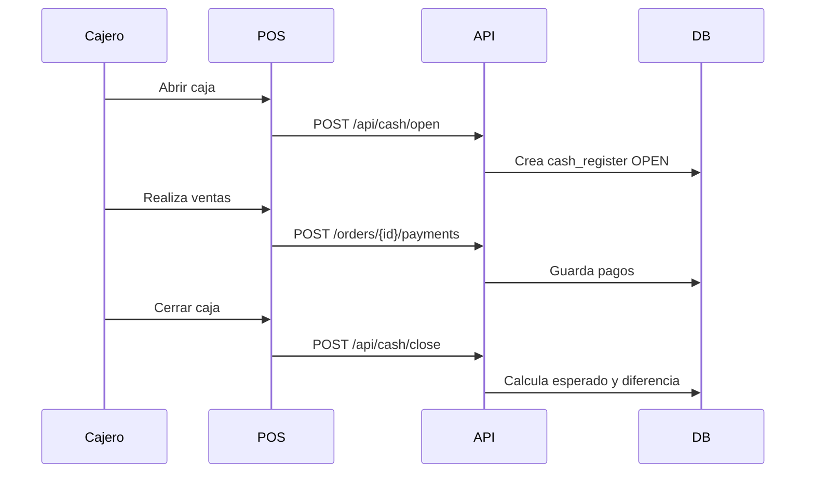

Mejoras:

- Relación directa `payments.cash_register_id`.
- Corte por usuario.
- Movimientos manuales de caja.
- Validar que no se registren pagos si no existe caja abierta.

### 16.6 Dominio de dashboard y estadísticas

Responsabilidad:

- Mostrar resumen financiero y operativo.
- Calcular ventas por rango.
- Mostrar productos/paquetes más vendidos.
- Mostrar distribución por método de pago.

Mejoras:

- Separar métricas por sucursal.
- Agregar comparativas periodo contra periodo.
- Agregar reportes de apartados pendientes.
- Agregar ocupación de eventos por día/semana/mes.
- Agregar utilización de salones y servicios.

## 17. Propuesta completa: gestión de eventos tipo Google Calendar

### 17.1 Objetivo del módulo

Agregar un módulo visual de agenda/calendario para administrar eventos infantiles, reservaciones, apartados, pagos pendientes y liquidaciones.

La experiencia esperada sería similar a Google Calendar:

- Vista mensual.
- Vista semanal.
- Vista diaria.
- Eventos por color/estado.
- Drag & drop para cambiar horario.
- Click en un evento para ver detalle.
- Crear evento desde una celda del calendario.
- Filtros por sucursal, salón, paquete, estado o responsable.

### 17.2 Entidades sugeridas

#### `event_spaces`

Representa salones, áreas o recursos reservables.

Campos:

| Campo | Uso |
|---|---|
| `id`, `public_id` | Identificación |
| `tenant_id`, `branch_id` | Aislamiento y sucursal |
| `name` | Nombre del salón/área |
| `capacity` | Capacidad |
| `active` | Disponible/no disponible |
| `color` | Color en calendario |
| `description` | Notas |

#### `events`

Representa un evento reservado o cotizado.

Campos:

| Campo | Uso |
|---|---|
| `id`, `public_id` | Identificación |
| `tenant_id`, `branch_id` | Multi-tenant |
| `event_space_id` | Salón/recurso |
| `order_id` | Orden relacionada |
| `package_product_id` | Paquete vendido |
| `customer_name` | Cliente |
| `customer_phone` | Teléfono |
| `customer_email` | Email |
| `child_name` | Niño(a) |
| `child_age` | Edad |
| `start_at`, `end_at` | Horario del evento |
| `guest_count` | Invitados |
| `status` | Estado del evento |
| `total_amount` | Total contratado |
| `deposit_required` | Apartado requerido |
| `deposit_paid` | Apartado pagado |
| `balance_due` | Saldo pendiente |
| `notes` | Notas internas |

Estados sugeridos:

| Estado | Significado |
|---|---|
| `QUOTE` | Cotización sin apartado |
| `RESERVED` | Apartado pagado, fecha bloqueada |
| `CONFIRMED` | Evento confirmado |
| `IN_PROGRESS` | Evento en curso |
| `COMPLETED` | Evento terminado |
| `CANCELLED` | Evento cancelado |
| `NO_SHOW` | Cliente no llegó |

#### `event_payments`

Pagos específicos de eventos/apartados.

Campos:

| Campo | Uso |
|---|---|
| `id`, `public_id` | Identificación |
| `event_id` | Evento |
| `payment_id` | Pago POS relacionado |
| `amount` | Monto |
| `type` | `DEPOSIT`, `PARTIAL`, `FINAL`, `REFUND` |
| `method` | Efectivo/tarjeta/transferencia |
| `reference` | Referencia |
| `created_by` | Usuario |
| `created_at` | Fecha |

#### `event_tasks`

Checklist operativo del evento.

Ejemplos:

- Confirmar número de invitados.
- Confirmar temática.
- Preparar pastel.
- Apartar salón.
- Preparar mobiliario.
- Liquidar saldo.
- Imprimir contrato.

Campos:

| Campo | Uso |
|---|---|
| `event_id` | Evento |
| `title` | Tarea |
| `status` | `PENDING`, `DONE`, `CANCELLED` |
| `due_at` | Fecha límite |
| `assigned_to` | Usuario responsable |

### 17.3 Reglas de negocio para eventos

1. No permitir dos eventos en el mismo salón con horarios cruzados.
2. Permitir cotizaciones sin bloquear horario (`QUOTE`).
3. Bloquear horario solo cuando exista apartado (`RESERVED`) o confirmación.
4. Calcular saldo pendiente:

```text
balanceDue = totalAmount - sum(eventPayments no cancelados)
```

5. Permitir pagos parciales.
6. Definir políticas de cancelación:
   - apartado no reembolsable;
   - reembolso parcial;
   - crédito para otra fecha.
7. Registrar quién cambió fecha, monto o estado.
8. Evitar mover eventos confirmados sin permiso `ADMIN`/`MANAGER`.

### 17.4 Sistema de apartado

El apartado es un pago inicial que bloquea la fecha/espacio.

Flujo recomendado:

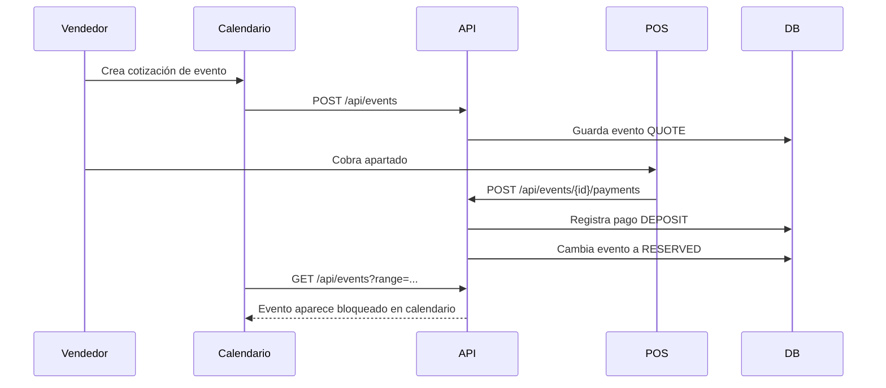

Estados de pago sugeridos:

| Estado | Condición |
|---|---|
| `UNPAID` | Sin pagos |
| `DEPOSIT_PENDING` | Requiere apartado |
| `DEPOSIT_PAID` | Apartado cubierto |
| `PARTIALLY_PAID` | Tiene abonos pero falta saldo |
| `PAID` | Liquidado |
| `REFUNDED` | Devuelto total/parcial |

### 17.5 Pagos pendientes

El calendario debe destacar eventos con saldo pendiente:

- Rojo: evento próximo con saldo vencido.
- Amarillo: saldo pendiente pero todavía dentro de plazo.
- Verde: liquidado.
- Gris: cotización sin apartado.

Reglas sugeridas:

- Configurar `finalPaymentDueDays`, por ejemplo liquidar 2 días antes.
- Generar alertas:
  - faltan 7 días y hay saldo;
  - faltan 2 días y hay saldo;
  - día del evento con saldo pendiente.
- Agregar dashboard de "Eventos por cobrar".

### 17.6 Integración con POS

Opciones:

#### Opción A: evento crea orden desde el inicio

- Al crear evento se crea una `Order`.
- El apartado se registra como `Payment` contra esa orden.
- Ventaja: reutiliza pagos/tickets.
- Desventaja: la orden queda abierta por días/semanas.

#### Opción B: evento tiene pagos propios y liquida en POS

- `event_payments` guarda apartados.
- Al llegar el día, se genera/liquida una `Order`.
- Ventaja: separa agenda de venta diaria.
- Desventaja: requiere conciliación entre evento y orden.

Recomendación:

- Usar `events` como entidad principal y relacionarla opcionalmente con `orders`.
- Registrar pagos con un modelo común o una relación a `payments`.
- Asociar liquidación final al POS/caja del día.

### 17.7 Endpoints sugeridos

| Método | Endpoint | Uso |
|---|---|---|
| `GET` | `/api/events?from=&to=&branchId=&spaceId=&status=` | Listar eventos para calendario |
| `POST` | `/api/events` | Crear evento/cotización |
| `GET` | `/api/events/{publicId}` | Detalle |
| `PUT` | `/api/events/{publicId}` | Editar datos |
| `PATCH` | `/api/events/{publicId}/reschedule` | Mover fecha/hora |
| `POST` | `/api/events/{publicId}/payments` | Registrar apartado/abono |
| `POST` | `/api/events/{publicId}/confirm` | Confirmar |
| `POST` | `/api/events/{publicId}/cancel` | Cancelar |
| `GET` | `/api/events/pending-payments` | Eventos con saldo |
| `GET` | `/api/event-spaces` | Salones/recursos |
| `POST` | `/api/event-spaces` | Crear salón/recurso |

### 17.8 Frontend recomendado para calendario

Componentes:

| Componente | Función |
|---|---|
| `EventsCalendarPage` | Página principal |
| `CalendarGrid` | Vista mes/semana/día |
| `EventCard` | Tarjeta visual |
| `EventDetailDrawer` | Detalle lateral |
| `EventFormModal` | Crear/editar |
| `EventPaymentPanel` | Apartados/abonos/saldo |
| `EventStatusBadge` | Estado visual |
| `EventFilters` | Filtros |
| `SpaceSelector` | Salón/recurso |

Librerías posibles:

- `FullCalendar`: opción más completa y parecida a Google Calendar.
- `react-big-calendar`: opción simple y flexible.
- Implementación propia con CSS grid: más control, más trabajo.

Recomendación profesional:

- Usar `FullCalendar` si el objetivo es drag & drop, vistas completas y rapidez.
- Mantener el estado de eventos en backend; el frontend solo renderiza y edita.

### 17.9 Validación de disponibilidad

Consulta de disponibilidad:

```text
Hay conflicto si:
existing.start_at < new.end_at
AND existing.end_at > new.start_at
AND same event_space_id
AND status IN (RESERVED, CONFIRMED, IN_PROGRESS)
```

Índices recomendados:

```text
events(tenant_id, branch_id, event_space_id, start_at, end_at)
events(tenant_id, status, start_at)
event_payments(event_id, created_at)
```

### 17.10 Vista de developer: flujo completo de evento

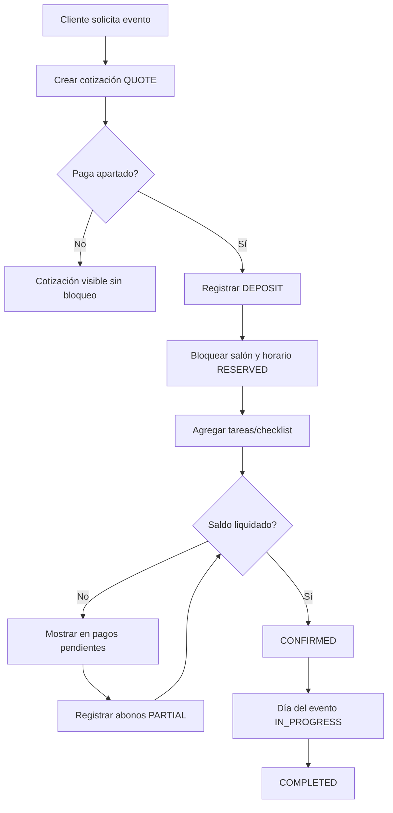

## 18. Diagrama de base de datos propuesto para eventos

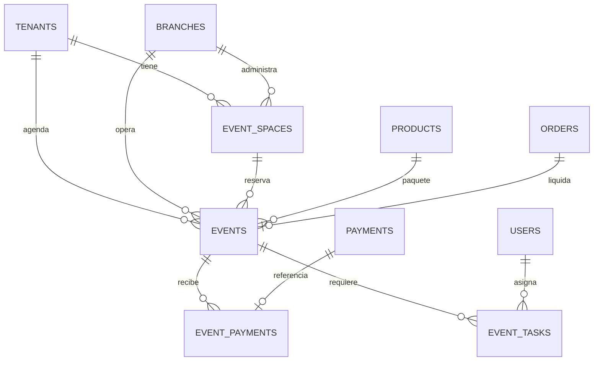

Tablas nuevas mínimas:

| Tabla | Objetivo |
|---|---|
| `event_spaces` | Salones, áreas o recursos reservables |
| `events` | Evento/cotización/reservación |
| `event_payments` | Apartados, abonos, liquidaciones y reembolsos |
| `event_tasks` | Checklist operativo |
| `event_status_history` | Historial de cambios de estado |

## 19. Recomendaciones de implementación para nuevos contributors

### 19.1 Orden recomendado de trabajo

1. Agregar migraciones y limpiar secretos.
2. Crear entidades/eventos sin UI.
3. Agregar endpoints backend con pruebas.
4. Agregar calendario solo lectura.
5. Agregar creación/edición.
6. Agregar apartados/pagos pendientes.
7. Integrar con POS/caja.
8. Agregar reportes.

### 19.2 Pruebas mínimas esperadas

Backend:

- Crear evento sin conflicto.
- Rechazar evento con horario cruzado.
- Registrar apartado y cambiar a `RESERVED`.
- Calcular saldo pendiente.
- Cancelar evento con pagos.
- Listar eventos por rango de calendario.

Frontend:

- Renderizar calendario por mes/semana/día.
- Crear evento.
- Mostrar saldo pendiente.
- Registrar apartado.
- Cambiar estado visual según status.
- Validar errores de disponibilidad.

### 19.3 Criterios de aceptación para módulo de eventos

Un primer MVP estaría listo cuando:

- Admin/manager puede crear salones.
- Admin/manager puede crear evento desde calendario.
- El sistema valida conflictos.
- Se puede registrar apartado.
- El evento bloquea horario.
- Se muestra saldo pendiente.
- Se puede liquidar pago final.
- El evento aparece con color según estado.
- El dashboard muestra eventos por cobrar.
