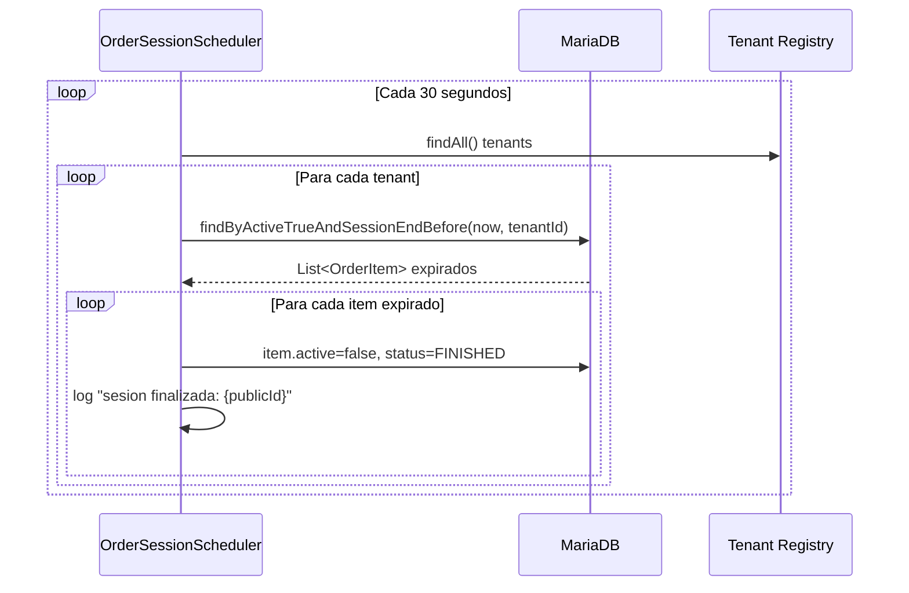
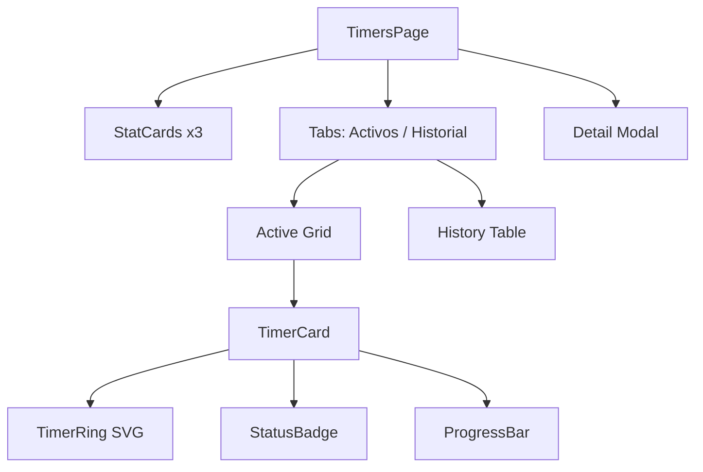
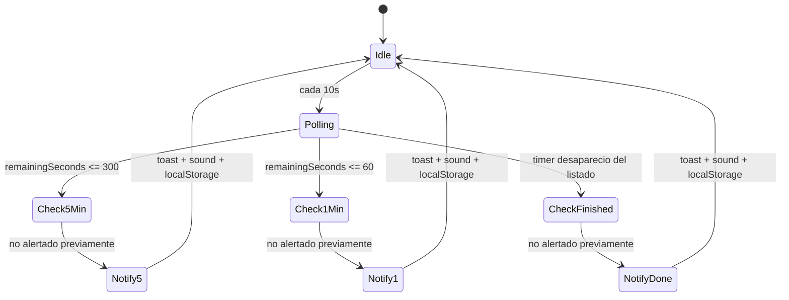
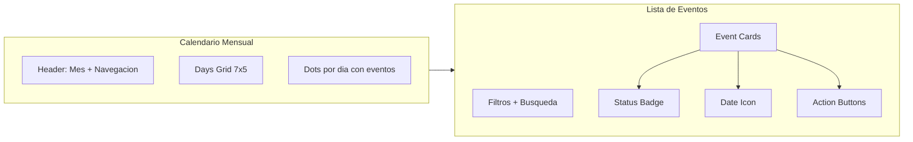
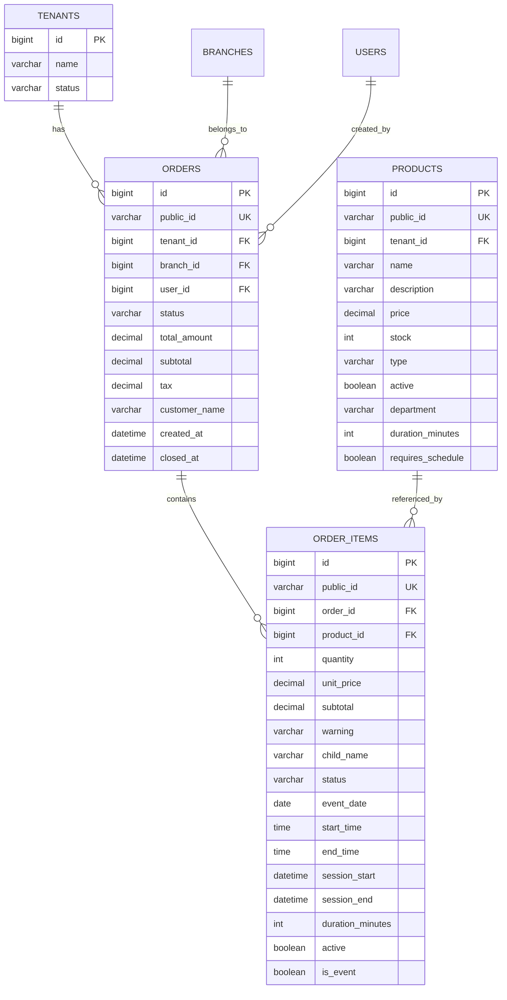
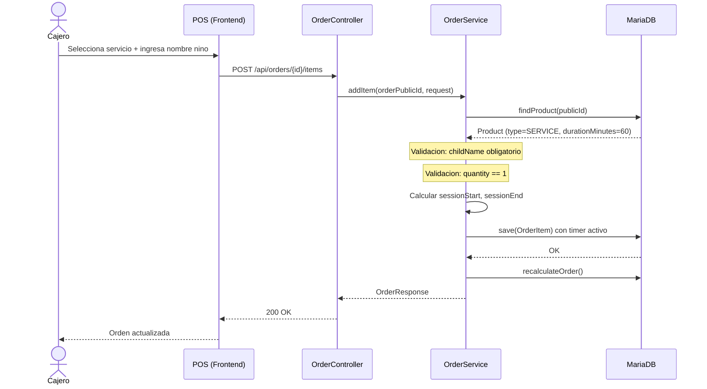
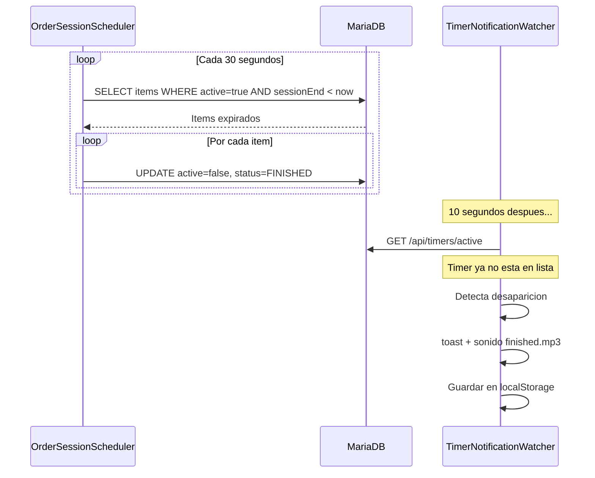

# Timers, Eventos, Calendario, Ordenes y Automatizacion de Cierre

## Documentacion Tecnica Consolidada — SalonEventosSaas

**Version:** 1.0  
**Ultima actualizacion:** 2026-06-19  
**Stack:** Java 25 / Spring Boot 4 / MariaDB / React Router 7 / TypeScript / Tailwind CSS + DaisyUI

---

## Indice

1. [Arquitectura General](#1-arquitectura-general)
2. [Backend — Modulo de Ordenes y Timers](#2-backend--modulo-de-ordenes-y-timers)
3. [Backend — Scheduler de Cierre Automatico](#3-backend--scheduler-de-cierre-automatico)
4. [Backend — APIs REST](#4-backend--apis-rest)
5. [Frontend — Pagina de Timers](#5-frontend--pagina-de-timers)
6. [Frontend — Sistema de Notificaciones](#6-frontend--sistema-de-notificaciones)
7. [Frontend — Modulo de Eventos / Calendario](#7-frontend--modulo-de-eventos--calendario)
8. [Base de Datos](#8-base-de-datos)
9. [Diagramas de Flujo](#9-diagramas-de-flujo)
10. [Casos de Uso](#10-casos-de-uso)
11. [Changelog](#11-changelog)
12. [Riesgos y Consideraciones](#12-riesgos-y-consideraciones)

---

## 1. Arquitectura General

El sistema sigue una arquitectura **multi-tenant SaaS** donde cada tenant (negocio) opera de forma aislada. Los timers y eventos son submodulos del dominio de ordenes (`order`).

```mermaid
graph TB
    subgraph Frontend["Frontend (React Router 7)"]
        TP[Timers Page]
        EP[Eventos Page]
        TNW[TimerNotificationWatcher]
        TR[TimerRing Component]
        POS[POS Page]
    end

    subgraph Backend["Backend (Spring Boot 4)"]
        TC[TimerController]
        OC[OrderController]
        TS[TimerService]
        OS[OrderService]
        OSS[OrderSessionScheduler]
    end

    subgraph Database["MariaDB"]
        OT[orders]
        OIT[order_items]
        PT[products]
    end

    TP -->|GET /api/timers/active| TC
    TP -->|GET /api/timers/dashboard| TC
    TP -->|GET /api/timers/history| TC
    TNW -->|polling 10s| TC
    POS -->|POST /api/orders/.../items| OC

    TC --> TS
    OC --> OS
    TS --> OIT
    OS --> OIT
    OS --> OT
    OSS -->|@Scheduled 30s| OIT

    OIT --> PT
    OIT --> OT
```

### Componentes Principales

| Capa | Componente | Responsabilidad |
|------|-----------|-----------------|
| Frontend | `timers.tsx` | Dashboard de sesiones activas con countdown en tiempo real |
| Frontend | `TimerNotificationWatcher.tsx` | Polling global y alertas sonoras |
| Frontend | `TimerRing.tsx` | Visualizacion SVG circular de progreso |
| Frontend | `eventos.tsx` | Gestion de eventos/reservaciones con calendario |
| Backend | `TimerController` | Endpoints REST para timers |
| Backend | `TimerService` | Logica de negocio de sesiones activas e historial |
| Backend | `OrderService` | CRUD de ordenes, creacion de timers al agregar items SERVICE |
| Backend | `OrderSessionScheduler` | Cron job cada 30s para cierre automatico |
| DB | `order_items` | Almacena `session_start`, `session_end`, `duration_minutes`, `active` |

---

## 2. Backend — Modulo de Ordenes y Timers

### 2.1 Modelo de Datos

#### Entity: `Order`

```java
@Entity
@Table(name = "orders")
public class Order {
    Long id;
    String publicId;           // UUID auto-generado
    Tenant tenant;             // Multi-tenancy
    Branch branch;
    User user;
    OrderStatus status;        // OPEN | PARTIALLY_PAID | CLOSED | CANCELLED
    BigDecimal totalAmount;
    BigDecimal subtotal;
    BigDecimal tax;
    String customerName;
    LocalDateTime createdAt;
    LocalDateTime closedAt;
}
```

#### Entity: `OrderItem`

```java
@Entity
@Table(name = "order_items")
public class OrderItem {
    Long id;
    String publicId;           // UUID auto-generado
    Order order;
    Product product;
    Integer quantity;
    BigDecimal unitPrice;
    BigDecimal subtotal;
    String warning;
    String childName;          // Nombre del nino (para servicios)
    OrderItemStatus status;    // ACTIVE | VOIDED | FINISHED

    // --- Campos de Evento ---
    LocalDate eventDate;
    LocalTime startTime;
    LocalTime endTime;

    // --- Campos de Timer ---
    LocalDateTime sessionStart;
    LocalDateTime sessionEnd;
    Integer durationMinutes;
    Boolean active;

    Boolean isEvent;           // Flag para distinguir items de evento
}
```

### 2.2 Enums

```java
public enum OrderStatus {
    OPEN, PARTIALLY_PAID, CLOSED, CANCELLED
}

public enum OrderItemStatus {
    ACTIVE, VOIDED, FINISHED
}

public enum ProductType {
    PRODUCT, SERVICE, PACKAGE
}
```

### 2.3 Reglas de Negocio para Timers

Al agregar un item de tipo `SERVICE` a una orden:

1. **childName obligatorio** — Se debe capturar el nombre del nino
2. **Cantidad fija = 1** — Los servicios no permiten multiples unidades
3. **Timer automatico** — Se calcula `sessionStart = now()` y `sessionEnd = now + durationMinutes`
4. **Flag `active = true`** — Marca el item como sesion en curso

```java
// Fragmento de OrderService.addItem()
if (product.getType() == ProductType.SERVICE) {
    LocalDateTime now = LocalDateTime.now();
    item.setSessionStart(now);
    item.setDurationMinutes(product.getDurationMinutes());
    item.setSessionEnd(now.plusMinutes(product.getDurationMinutes()));
    item.setActive(true);
}
```

### 2.4 TimerService — Logica Principal

```java
@Service
public class TimerService {

    // Obtiene todas las sesiones activas del tenant
    public List<ActiveSessionResponse> getActiveSessions() {
        List<OrderItem> items = orderItemRepository.findActiveTimers(tenantId);
        return items.stream().map(item -> mapToResponse(item, now)).toList();
    }

    // Historial paginado con filtros
    public Page<TimerHistoryResponse> getSessionHistory(
        String search, String status, LocalDate date, Integer page, Integer size
    ) { ... }

    // Dashboard con metricas
    public TimerDashboardResponse getTimersDashboard() {
        // activeSessions, expiringSoon (<=300s), finishedToday
    }
}
```

**Calculo de `expiringSoon`:** Un timer se considera "proximo a expirar" cuando le quedan <= 300 segundos (5 minutos).

**Calculo de `progressPercent`:**
```
elapsed = durationMinutes * 60 - remainingSeconds
progress = min(100, max(0, (elapsed * 100) / (durationMinutes * 60)))
```

---

## 3. Backend — Scheduler de Cierre Automatico

### `OrderSessionScheduler`

```java
@Service
@RequiredArgsConstructor
public class OrderSessionScheduler {

    @Scheduled(fixedRate = 30000) // Cada 30 segundos
    public void closeFinishedSessions() {
        LocalDateTime now = LocalDateTime.now();
        List<Tenant> tenants = tenantRepository.findAll();

        for (Tenant tenant : tenants) {
            List<OrderItem> items = orderItemRepository
                .findByActiveTrueAndSessionEndBeforeAndOrder_Tenant_Id(now, tenant.getId());

            for (OrderItem item : items) {
                item.setActive(false);
                item.setStatus(OrderItemStatus.FINISHED);
                orderItemRepository.save(item);
            }
        }
    }
}
```

### Comportamiento

| Aspecto | Detalle |
|---------|---------|
| Frecuencia | Cada 30 segundos (`fixedRate = 30000`) |
| Habilitacion | `@EnableScheduling` en `DemoApplication` |
| Scope | Itera sobre TODOS los tenants |
| Condicion | `active = true AND sessionEnd < now()` |
| Accion | `active = false`, `status = FINISHED` |
| Logging | Imprime en consola el `publicId` del item finalizado |



---

## 4. Backend — APIs REST

### 4.1 Timer Endpoints

| Metodo | Endpoint | Descripcion | Respuesta |
|--------|----------|-------------|-----------|
| `GET` | `/api/timers/active` | Sesiones activas del tenant | `List<ActiveSessionResponse>` |
| `GET` | `/api/timers/history` | Historial paginado con filtros | `Page<TimerHistoryResponse>` |
| `GET` | `/api/timers/dashboard` | Metricas resumidas | `TimerDashboardResponse` |

#### Parametros de `/api/timers/history`

| Param | Tipo | Requerido | Default | Descripcion |
|-------|------|-----------|---------|-------------|
| `search` | String | No | null | Busca en childName y customerName |
| `status` | String | No | null | Filtro por `ACTIVE`, `FINISHED`, `VOIDED` |
| `date` | LocalDate | No | null | Filtra por fecha de sessionStart |
| `page` | Integer | No | 0 | Pagina (0-indexed) |
| `size` | Integer | No | 10 | Tamano de pagina (max 100) |

### 4.2 Order Endpoints

| Metodo | Endpoint | Descripcion |
|--------|----------|-------------|
| `POST` | `/api/orders` | Crear orden |
| `POST` | `/api/orders/{id}/items` | Agregar item (inicia timer si es SERVICE) |
| `POST` | `/api/orders/{id}/items/{itemId}/void` | Anular item |
| `PUT` | `/api/orders/{id}/items/{itemId}` | Actualizar cantidad |
| `GET` | `/api/orders/{id}` | Obtener orden con items |
| `POST` | `/api/orders/{id}/close` | Cerrar orden (requiere pago completo) |
| `POST` | `/api/orders/{id}/cancel` | Cancelar orden (restaura stock) |

### 4.3 Ejemplo de Request/Response

**POST `/api/orders/{orderId}/items`** — Iniciar un timer:

```json
{
  "productPublicId": "uuid-del-servicio",
  "quantity": 1,
  "childName": "Pedrito"
}
```

**Response `ActiveSessionResponse`:**

```json
{
  "itemPublicId": "uuid-item",
  "orderPublicId": "uuid-orden",
  "customerName": "Maria Lopez",
  "childName": "Pedrito",
  "productName": "Hora de juego (60 min)",
  "sessionStart": "2026-06-19T10:00:00",
  "sessionEnd": "2026-06-19T11:00:00",
  "durationMinutes": 60,
  "remainingSeconds": 2400,
  "remainingMinutes": 40,
  "expiringSoon": false,
  "expired": false,
  "progressPercent": 33,
  "status": "ACTIVE"
}
```

**Response `TimerDashboardResponse`:**

```json
{
  "activeSessions": 5,
  "expiringSoon": 2,
  "finishedToday": 12,
  "expired": 0,
  "totalTodayMinutes": 0
}
```

---

## 5. Frontend — Pagina de Timers

### 5.1 Estructura del Componente (`timers.tsx`)



### 5.2 Polling y Actualizacion en Tiempo Real

- **Intervalo de fetch:** 1000ms (1 segundo) — garantiza countdown fluido
- **Proteccion anti-duplicados:** `isFetchingRef` previene llamadas simultaneas
- **Contador local independiente:** `setInterval(() => setNow(Date.now()), 1000)`

### 5.3 Logica de Estados Visuales

| Condicion | Badge | Color borde | Barra progreso | Animacion |
|-----------|-------|-------------|----------------|-----------|
| `expired = true` | "Finalizada" | `border-error` | `bg-error` | Ninguna |
| `expiringSoon = true` | "Expira pronto" | `border-warning` | `bg-warning` | `animate-pulse` |
| Normal | "Activa" | `border-success` | `bg-success` | Ninguna |

### 5.4 TimerRing — Componente SVG

Renderiza un anillo SVG circular con:
- **Radio:** 50px, **Stroke:** 12px
- **Colores:** Verde (activo), Amarillo (expirando), Gris (finalizado)
- **Efecto glow:** `drop-shadow` dinamico segun estado
- **Texto central:** Minutos restantes + porcentaje

### 5.5 Historial de Sesiones

Tabla paginada con filtros:
- Busqueda por nombre de nino/cliente
- Filtro por estado (ACTIVE, FINISHED, CANCELLED)
- Filtro por fecha
- Paginacion server-side

---

## 6. Frontend — Sistema de Notificaciones

### 6.1 TimerNotificationWatcher (Componente Global)

Componente montado a nivel de layout que opera independiente de la pagina activa.



### 6.2 Umbrales de Alerta

| Umbral | Condicion | Sonido | Tipo |
|--------|-----------|--------|------|
| 5 minutos | `remaining <= 300 && remaining > 60` | `/sounds/warning.mp3` | warning |
| 1 minuto | `remaining <= 60 && remaining > 0` | `/sounds/warning.mp3` | warning |
| Finalizado | Timer desaparece del array activo | `/sounds/finished.mp3` | success |

### 6.3 Persistencia Anti-Duplicados

- Se usa `localStorage` con claves: `timer_notifications_5min`, `timer_notifications_1min`, `timer_notifications_finished`
- Sets serializados como JSON arrays
- Al detectar finalizacion, se limpia el timer de los sets de 5min y 1min

---

## 7. Frontend — Modulo de Eventos / Calendario

### 7.1 Pagina de Eventos (`eventos.tsx`)

Modulo de gestion de reservaciones/fiestas infantiles con:

- **Vista calendario:** Grid 7x5 con dots indicando dias con eventos
- **Lista de eventos:** Cards con informacion de cliente, paquete, ninos, total
- **Filtros:** Busqueda por texto + filtro por estado
- **CRUD:** Crear, editar, eliminar eventos
- **Stats rapidas:** Total, Activos, Pendientes, Ingresos

### 7.2 Modelo de Evento (Frontend Mock)

```typescript
interface Event {
    id: number;
    date: string;
    client: string;
    package: string;       // Paquete contratado
    children: number;      // Numero de ninos
    total: number;         // Monto total
    status: "active" | "pending" | "cancelled";
}
```

### 7.3 Integracion con OrderItem (Backend)

Los eventos utilizan campos especificos en `OrderItem`:

| Campo | Tipo | Uso |
|-------|------|-----|
| `eventDate` | `LocalDate` | Fecha del evento |
| `startTime` | `LocalTime` | Hora de inicio |
| `endTime` | `LocalTime` | Hora de fin |
| `isEvent` | `Boolean` | Distingue items de evento vs timer |

**Query del repositorio:**
```java
List<OrderItem> findByEventDateAndOrder_Tenant_Id(LocalDate date, Long tenantId);
```

### 7.4 Calendario Visual



---

## 8. Base de Datos

### 8.1 Esquema de Tablas Relevantes



### 8.2 Indices y Queries Criticas

**Timers activos:**
```sql
SELECT oi.*
FROM order_items oi
JOIN orders o ON oi.order_id = o.id
JOIN products p ON oi.product_id = p.id
WHERE o.tenant_id = :tenantId
  AND oi.active = true
  AND p.type = 'SERVICE'
  AND oi.session_start IS NOT NULL
  AND oi.session_end IS NOT NULL
  AND oi.duration_minutes IS NOT NULL
ORDER BY oi.session_end ASC
```

**Cierre automatico:**
```sql
SELECT oi.*
FROM order_items oi
JOIN orders o ON oi.order_id = o.id
WHERE oi.active = true
  AND oi.session_end < NOW()
  AND o.tenant_id = :tenantId
```

**Historial con filtros:**
```sql
SELECT oi.*
FROM order_items oi
JOIN orders o ON oi.order_id = o.id
JOIN products p ON oi.product_id = p.id
WHERE o.tenant_id = :tenantId
  AND p.type = 'SERVICE'
  AND oi.session_start IS NOT NULL
  AND (:status IS NULL OR oi.status = :status)
  AND (:search IS NULL
       OR LOWER(oi.child_name) LIKE LOWER(CONCAT('%',:search,'%'))
       OR LOWER(o.customer_name) LIKE LOWER(CONCAT('%',:search,'%')))
  AND (:startDate IS NULL OR oi.session_start BETWEEN :startDate AND :endDate)
ORDER BY oi.session_start DESC
```

---

## 9. Diagramas de Flujo

### 9.1 Flujo Completo: Inicio de Timer



### 9.2 Flujo Completo: Cierre Automatico



### 9.3 Flujo: Cierre de Orden

```mermaid
flowchart TD
    A[POST /api/orders/{id}/close] --> B{Estado actual?}
    B -->|CLOSED| C[Retorna orden sin cambios]
    B -->|CANCELLED| D[Error: No se puede cerrar]
    B -->|OPEN/PARTIALLY_PAID| E{Pago >= Total?}
    E -->|No| F[Error: Pago incompleto]
    E -->|Si| G[status = CLOSED]
    G --> H[closedAt = now]
    H --> I[Retorna OrderResponse]
```

---

## 10. Casos de Uso

### CU-01: Iniciar sesion de juego

| Campo | Valor |
|-------|-------|
| **Actor** | Cajero / Empleado |
| **Precondicion** | Orden abierta, producto tipo SERVICE disponible |
| **Flujo principal** | 1. Cajero abre POS 2. Crea o selecciona orden 3. Agrega servicio con nombre del nino 4. Sistema calcula horarios y activa timer |
| **Postcondicion** | Timer aparece en `/dashboard/timers` |
| **Excepciones** | childName vacio, stock insuficiente (modo STRICT) |

### CU-02: Monitorear sesiones activas

| Campo | Valor |
|-------|-------|
| **Actor** | Cajero / Gerente |
| **Precondicion** | Al menos un timer activo |
| **Flujo principal** | 1. Navegar a Timers 2. Ver grid de cards con countdown 3. Identificar sesiones por expireSoon (amarillo) o expired (rojo) |
| **Postcondicion** | Operador informado del estado de sesiones |

### CU-03: Recibir alerta de tiempo

| Campo | Valor |
|-------|-------|
| **Actor** | Cualquier usuario autenticado |
| **Precondicion** | Timer activo con <=5 min restantes |
| **Flujo principal** | 1. TimerNotificationWatcher detecta umbral 2. Muestra toast + sonido 3. Guarda en localStorage para evitar duplicados |
| **Postcondicion** | Operador alertado |

### CU-04: Cierre automatico de sesion

| Campo | Valor |
|-------|-------|
| **Actor** | Sistema (Scheduler) |
| **Precondicion** | Timer con `sessionEnd < now()` |
| **Flujo principal** | 1. Scheduler ejecuta cada 30s 2. Busca items expirados por tenant 3. Marca `active=false`, `status=FINISHED` |
| **Postcondicion** | Timer ya no aparece en sesiones activas |

### CU-05: Consultar historial de sesiones

| Campo | Valor |
|-------|-------|
| **Actor** | Gerente / Admin |
| **Precondicion** | Sesiones finalizadas existentes |
| **Flujo principal** | 1. Ir a Timers > Historial 2. Aplicar filtros (busqueda, estado, fecha) 3. Navegar paginas |
| **Postcondicion** | Informacion consultada |

### CU-06: Gestionar evento/reservacion

| Campo | Valor |
|-------|-------|
| **Actor** | Admin / Gerente |
| **Precondicion** | Modulo de eventos disponible |
| **Flujo principal** | 1. Ir a Eventos 2. Ver calendario con dias marcados 3. Crear nuevo evento con cliente, paquete, fecha, ninos 4. Filtrar por estado |
| **Postcondicion** | Evento registrado en el sistema |

---

## 11. Changelog

| Version | Fecha | Descripcion |
|---------|-------|-------------|
| 1.0 | 2026-06-19 | Documentacion inicial consolidada |
| — | — | Incluye: Timers, Eventos, Ordenes, Scheduler, Notificaciones |

---

## 12. Riesgos y Consideraciones

### 12.1 Rendimiento

| Riesgo | Impacto | Mitigacion actual | Mejora sugerida |
|--------|---------|-------------------|-----------------|
| Polling frontend cada 1s | Alto trafico de red | `isFetchingRef` previene duplicados | WebSocket o SSE para push |
| Scheduler itera TODOS los tenants | Lento con muchos tenants | Ninguna | Query unica sin loop de tenants |
| `findAll()` de tenants en scheduler | Carga innecesaria en DB | Ninguna | Query directa: `WHERE active=true AND sessionEnd < now` |
| Guardar item por item en loop | N+1 writes | `save()` individual | `saveAll()` en batch |

### 12.2 Consistencia

| Riesgo | Descripcion | Mitigacion |
|--------|-------------|------------|
| Ventana de 30s | Un timer puede mostrar "expirado" hasta 30s antes de cerrarse en DB | Frontend calcula `expired` client-side |
| Race condition | Dos instancias del scheduler podrian procesar el mismo item | Baja probabilidad en single-instance; usar `@Transactional` + lock optimista para HA |
| Timezone | `LocalDateTime.now()` depende del timezone del servidor | Estandarizar con UTC o zona configurada |

### 12.3 UX y Notificaciones

| Riesgo | Descripcion | Mitigacion |
|--------|-------------|------------|
| Notificaciones duplicadas | Re-render podria disparar alertas multiples | Sets en `useRef` + `localStorage` |
| Sonido bloqueado | Navegadores bloquean autoplay sin interaccion previa | `.catch()` silencioso; requiere click previo |
| Tab inactiva | `setInterval` puede throttlearse en tabs inactivas | `TimerNotificationWatcher` opera independiente |

### 12.4 Escalabilidad Futura

| Area | Recomendacion |
|------|---------------|
| Real-time | Migrar de polling a WebSocket (SockJS/STOMP o SSE) |
| Scheduler | Usar `ShedLock` o equivalente para entornos multi-instancia |
| Eventos | Integrar calendario con backend (actualmente usa mock data) |
| Metricas | Completar `totalTodayMinutes` y `expired` en dashboard |
| Auditoria | Registrar quien inicio/cerro cada sesion con timestamps |

---

## Apendice A: Estructura de Archivos

```
backend/src/main/java/com/example/demo/
  order/
    controller/
      OrderController.java
      TimerController.java
    service/
      OrderService.java
      TimerService.java
      OrderSessionScheduler.java
    repository/
      OrderRepository.java
      OrderItemRepository.java
    dto/
      ActiveSessionResponse.java
      TimerDashboardResponse.java
      TimerHistoryResponse.java
      TimerHistoryFilterRequest.java
      OrderCreateRequest.java
      OrderItemRequest.java
      OrderResponse.java
      OrderItemResponse.java
    model/
      Order.java
      OrderItem.java

frontend/app/
  routes/dashboard/
    timers.tsx
    eventos.tsx
    pos.tsx
  components/
    TimerRing.tsx
    TimerNotificationWatcher.tsx
  lib/
    api.ts
    sound.ts
  data/
    mockData.ts
```

---

## Apendice B: Configuracion del Scheduler

```yaml
# application.yml (implicito via @EnableScheduling)
spring:
  task:
    scheduling:
      pool:
        size: 1  # Default single-threaded
```

La anotacion `@EnableScheduling` en `DemoApplication.java` activa el soporte de tareas programadas. El scheduler `OrderSessionScheduler` usa `@Scheduled(fixedRate = 30000)` para ejecutar cada 30 segundos independientemente de la duracion de la ejecucion anterior.
